# Architecture & intégrations — ContexFly

Source de vérité des schémas : le **Mermaid de ce fichier**. Le board Miro en est une projection —
**les modifications faites sur le board ne remontent pas ici**, il faut me le dire.

**Board Miro :** `ContexFly — Architecture & intégrations` (créé le 2026-08-19, 5 diagrammes).

> ✅ **Statut : contraintes intégrées (2026-08-19).** Vérifications Meta et Notch Pay rendues et
> portées en note sur les diagrammes.
>
> ⚠️ **Hypothèse de travail assumée (décision Maxime, 2026-08-19) :** l'analyse se poursuit en
> considérant que **Meta et Notch Pay couvrent le besoin**. Côté Meta, tout est vérifié et validé.
> Côté Notch Pay, **la garde des fonds reste non documentée** — vérifié deux fois, directement sur
> `/sync`, `/sync/integration` et `/sync/account-management`. Ce point est **supposé favorable**,
> pas établi. Il reste ouvert en Q29 et doit être confirmé par écrit avant mise en production.
> **L'agent de codage ne doit pas le lire comme un fait vérifié.**

---

## 1. Inventaire des éléments communicants

### 1.1 Webhooks entrants

| # | Élément | Source | Vers | Déclencheur | Contenu | Comportement en cas d'échec |
|---|---|---|---|---|---|---|
| **W1** | Message reçu | Meta | M3 | Un client écrit | Message, `phone_number_id`, expéditeur, média éventuel | ⚠️ à vérifier : réessais Meta, doublons, ordre |
| **W2** | Statut de message | Meta | M3 | Envoyé / délivré / lu / échec | Identifiant du message, statut, code d'erreur | Statut perdu = compteur d'I2 faussé |
| **W3** | Statut de template | Meta | M3 | Approbation ou rejet | Nom du template, statut, motif | Sans lui, le commerçant ne sait pas que sa campagne est bloquée |
| **W4** | Note de qualité / palier | Meta | M3 | Changement de note ou de palier d'envoi | Numéro concerné, nouvelle valeur | Alimente F7 (pédagogie) |
| **W5** | Paiement | Notch Pay | M7 | Confirmation ou échec | Référence, montant, statut, sous-compte | 🔴 **Point de défaillance le plus coûteux** — voir P5w |
| **W6** | Reversement | Notch Pay | M7 | Virement exécuté | Référence, montant, destinataire | Solde affiché faux |
| **W7** | Statut KYC | Notch Pay | M9 | Validation ou rejet d'un sous-marchand | Marchand, statut, motif | Le commerçant reste bloqué sans savoir pourquoi |

> 🔴 **Correction du 19/08 — le routage n'est pas uniforme.** W1 et W2 peuvent arriver sur un
> **endpoint par commerçant** (alternate webhook endpoint). **W3, W4 et les événements d'onboarding
> ne sont PAS surchargeables** : ils arrivent tous sur l'**URL par défaut de l'application**, et ne
> contiennent **aucun `phone_number_id`** — seulement le **WABA ID** dans `entry[].id`.
> **→ Deux chemins d'entrée distincts, et une table `WABA_ID → commerçant` obligatoire.**

### 1.2 Appels sortants vers des services externes

| # | Élément | De | Vers | Usage précis |
|---|---|---|---|---|
| **X1** | Envoi de message | M3 | Meta | Réponse de l'agent, message d'un vendeur, template |
| **X2** | Gestion des templates | M3 | Meta | Création, suivi de statut, liste |
| **X3** | Embedded Signup & WABA | M3 | Meta | Connexion du numéro d'un commerçant, abonnement aux webhooks |
| **X4** | Synchronisation catalogue | M2 | Meta | Pousser les produits vers le catalogue WhatsApp natif (B3) |
| **X5** | Création de sous-compte | M9 | Notch Pay | Ouverture du compte marchand + KYC |
| **X6** | Initiation d'encaissement | M7 | Notch Pay | Paiement MoMo d'un client final |
| **X7** | Vérification de transaction | M7 | Notch Pay | **Réconciliation** — filet quand W5 n'arrive pas |
| **X8** | Reversement | M7 | Notch Pay | Virement au commerçant |
| **X9** | Remboursement | M7 | Notch Pay | Annulation d'une commande payée (D7) |
| **X10** | Prélèvement d'abonnement | M10 | Notch Pay | Abonnement mensuel du commerçant |
| **X11** | Versement de commission | M11 | Notch Pay | Paiement d'un parrain (L5) |
| **X12** | Génération de réponse | M5 | Fournisseur de modèle | Raisonnement de l'agent + appels d'outils |
| **X13** | **Transcription vocale** | M3 | Service externe à choisir | **Meta ne fournit aucune transcription** — nécessaire pour A10 (notes vocales entrantes). Coût par minute, non modélisé |

⚠️ **X12 est le seul appel externe dont le coût est proportionnel à l'usage et non modélisé** (Q13).

### 1.3 Processus durables

Implémentés avec `@convex-dev/workflow` — durables, survivent aux redémarrages. **Aucun scan
périodique** : chaque instance programme sa propre échéance.

| # | Processus | Déclencheur | Étapes | Si ça échoue |
|---|---|---|---|---|
| **P1w** | Relance de conversation | Conversation passée en `active` | attente 3 h → relance gratuite (fenêtre ouverte) → attente 48 h → relance par template payant | Vente perdue silencieusement |
| **P2w** | Solde d'acompte | Commande avec acompte payé | attente de l'événement « statut = livrée » → réclamation du solde | Reste dû faux indéfiniment (R4) |
| **P3w** | Alerte de retour en stock | Client en attente sur une variante | attente de l'événement de réapprovisionnement → message `utility` | Promesse non tenue au client |
| **P4w** | Campagne de réengagement | Lancement par le commerçant | segmentation → envoi limité en débit → gestion de `131049` → réessai le lendemain | Quota brûlé, note de qualité dégradée |
| **P5w** | 🔴 Réconciliation de paiement | Encaissement initié | attente de W5 → si absent au bout de N, appel de X7 → si toujours indéterminé, escalade au back-office | **Client débité sans commande confirmée** |
| **P6w** | Reversement au commerçant | Calendrier | calcul du solde → X8 → attente de W6 | Commerçant impayé |
| **P7w** | Instruction KYC | Inscription d'un commerçant | collecte → X5 → attente de W7 → déblocage ou demande de complément | Onboarding bloqué sans explication |
| **P8w** | Relance d'abonnement | Échec de prélèvement | relances échelonnées → suspension | Service rendu sans paiement |
| **P9w** | Clawback de parrainage | Remboursement ou résiliation d'un filleul | reprise de la commission (R6) | Fuite de trésorerie |

### 1.4 Tâches planifiées

| # | Tâche | Fréquence | Rôle |
|---|---|---|---|
| **T1** | Recalcul des segments de fidélisation | quotidienne | Alimente F1 et les automatisations F3 |
| **T2** | Balayage de réconciliation | quotidienne | Filet de sécurité au-dessus de P5w — rattrape ce qu'aucun processus n'a clos |
| **T3** | Rétention et purge des données | quotidienne | Loi camerounaise n°2024/017 |

### 1.5 Acteurs humains dans les flux

| Acteur | Où il intervient | Ce qui dépend de lui |
|---|---|---|
| **Client final** | WhatsApp, page de paiement | Confirme le paiement sur son téléphone (MoMo) — étape hors de notre contrôle |
| **Gérant** | Application **et WhatsApp** (A14) | Valide les brouillons (P1), active le mode absence, marque un encaissement en espèces (R5) |
| **Vendeur** | Inbox | Reprend une conversation (A6) — sa correction alimente P2 |
| **Admin ContexFly** | Back-office | Instruit le KYC, tranche les litiges, relance un processus échoué |
| **Livreur** | Hors système | Reçoit la fiche C3 ; **aucune boucle de retour** — c'est le gérant qui saisit « livrée » |

⚠️ **Le livreur est un trou volontaire dans le système.** Décision G2/C3 : pas de gestion de
livreurs. Conséquence : la transition vers `livrée` dépend entièrement d'une saisie humaine, et
c'est elle qui déclenche P2w et le solde. **À surveiller — c'est le maillon le plus fragile de la
chaîne d'argent.**

---

## 2. Entités de données révélées par les intégrations

À reprendre impérativement au skill `donnees-et-roles` — elles n'apparaîtraient jamais en partant
des seules fonctionnalités :

- **Événement webhook reçu** — identifiant externe, type, charge utile, état de traitement,
  horodatage. Nécessaire à l'**idempotence** (W1 et W5 peuvent arriver en double).
- **Identifiant de corrélation** entre une commande ContexFly et une transaction Notch Pay.
- **Message sortant en attente** — file soumise à limitation de débit, avec son état et ses
  tentatives.
- **Template WhatsApp** — nom, catégorie, statut d'approbation, motif de rejet.
- **État de la fenêtre de service** par conversation — horodatage du dernier message client.
- **Note de qualité et palier d'envoi** par numéro.
- **Exécution de processus durable** — pour permettre à un administrateur de relancer (P5w, P7w).
- **Appel d'outil de l'agent** — arguments, résultat, durée, coût (R16, I2, I3, P2).
- **Sous-compte marchand** — référence Notch Pay, statut KYC, pièces transmises.
- **Clic de parrainage** — identifiant de clic capté côté serveur (L2), avant toute inscription.

**Ajouts du 19/08, révélés par la vérification Meta :**
- **Correspondance `WABA_ID → commerçant`** — obligatoire, distincte de `phone_number_id → commerçant`.
- **Coffre de secrets par commerçant** — PIN 2FA à 6 chiffres, `verify_token` du webhook, business
  token. Entité sensible → `Exigences-Non-Fonctionnelles.md`.
- **État « retenu par Meta »** dans la machine à états du message (`held_for_quality_assessment`),
  distinct de `sent` et de `failed`.
- **Libellé court de produit** (≤ 24 caractères) — distinct du nom, pour les listes interactives.
- **Template WhatsApp : 14 états**, pas 3, plus le motif de rejet et la recommandation textuelle
  de Meta.
- **Compteur glissant d'onboarding sur 7 jours** — le plafond Meta (10 puis 200 clients) est une
  contrainte de croissance à suivre au back-office.
- **Santé de connexion par commerçant** — détection d'`ACCOUNT_OFFBOARDED` (changement de téléphone)
  et parcours de reconnexion.

---

## 3. Vue d'ensemble

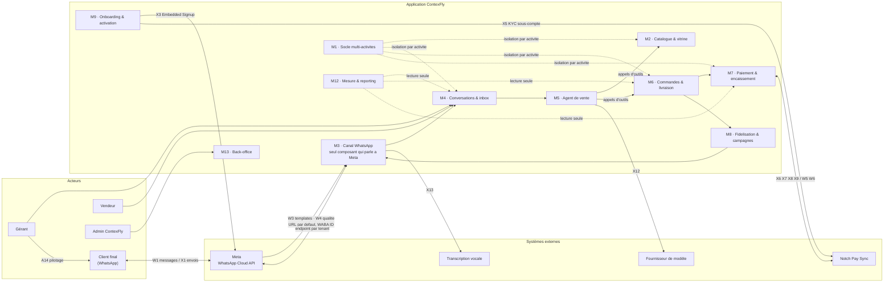

**Contraintes portées par ce schéma**
- 🔴 **Deux chemins d'entrée depuis Meta** : les webhooks de template et de compte arrivent sur
  l'**URL par défaut** (routage par **WABA ID**), les messages peuvent arriver sur un **endpoint par
  tenant** (routage par `phone_number_id`).
- **M3 est le seul composant qui parle à l'API WhatsApp** — décision d'architecture conservée du
  document de recherche initial.
- **M1 impose l'isolation par activité** à tous les modules porteurs de données (G1, R8).

---

## 4. Flux critique — de la conversation à la commande payée

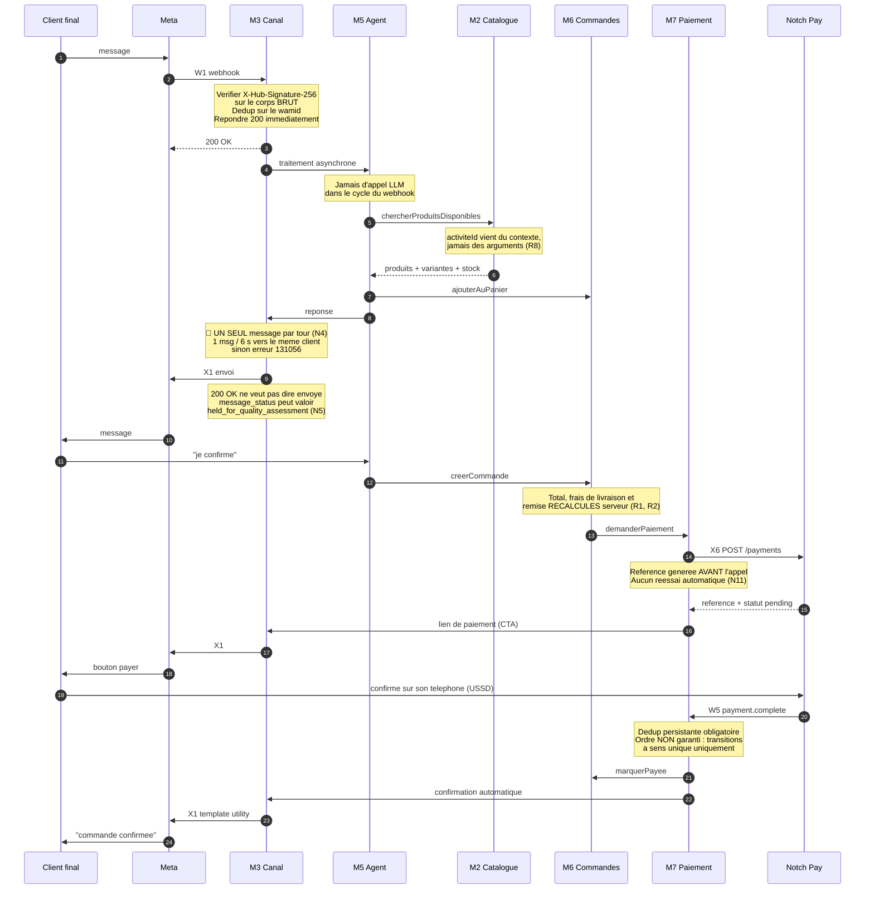

**Contraintes portées par ce diagramme**
- Fenêtre de service 24 h : la confirmation part en **`utility`**, gratuit dans la fenêtre.
- Le client **doit confirmer sur son téléphone** — étape hors du contrôle de ContexFly, 5-30 s
  annoncées, **délai d'expiration non documenté** (Q en attente).
- Aucune idempotence côté Meta **ni** côté Notch Pay → verrou et enregistrement **avant** l'appel.

---

## 5. P5w — réconciliation de paiement (le point de défaillance le plus coûteux)

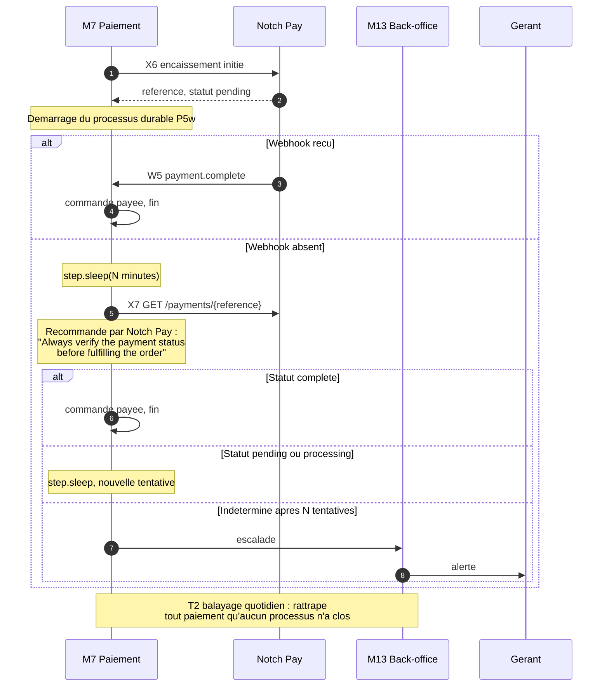

**Pourquoi ce processus n'est pas optionnel :** la politique de réessai des webhooks Notch Pay
n'est pas chiffrée (« several times with increasing delays »). **Le système est conçu comme si les
réessais n'existaient pas.** Sans P5w, le scénario est : client débité, commande non confirmée,
personne ne le sait.

---

## 6. Onboarding d'un commerçant

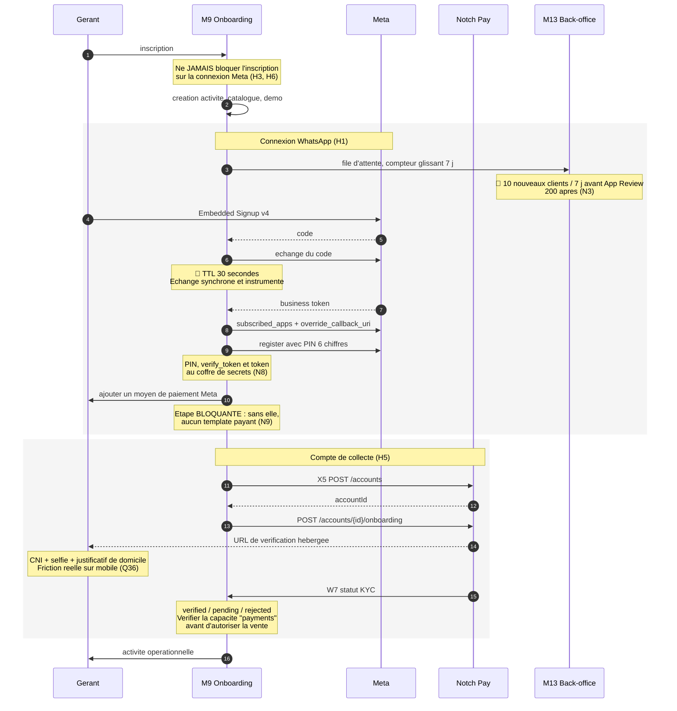

---

## 7. F4 — campagne de réengagement

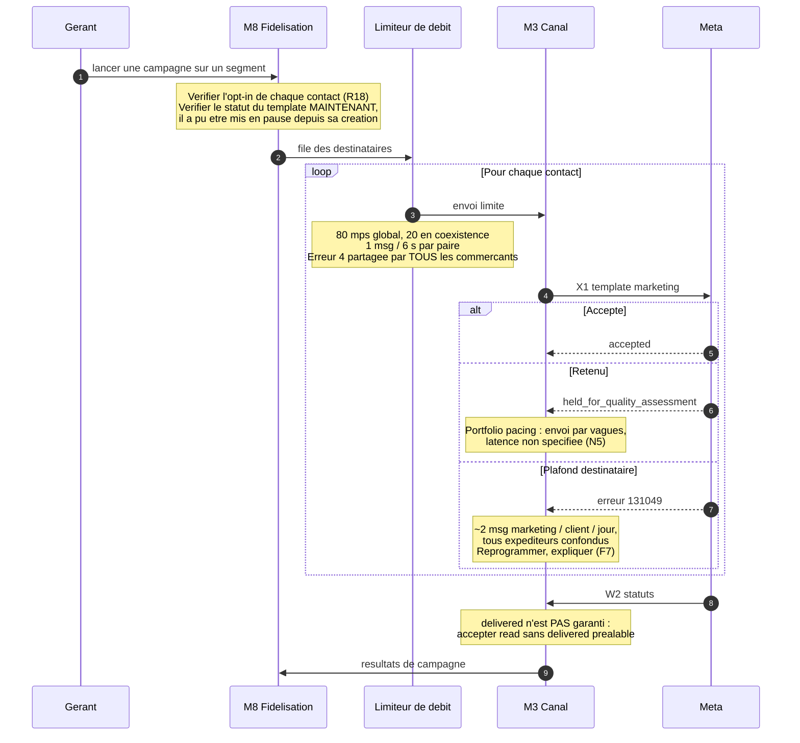

---

## 8. Contraintes externes rattachées aux intégrations

Détail complet et sourcé : `_contraintes-meta.md` et `_contraintes-notchpay.md`.
Synthèse opérationnelle : `Contraintes-Techniques.md` §1.

| Intégration | Contrainte la plus structurante |
|---|---|
| **X1 envoi** | 1 message toutes les 6 s vers le même client → **un seul message par tour** |
| **W1 réception** | Doublons explicites, ordre non garanti → **dédup sur wamid, machine à états monotone** |
| **W3/W4** | **Non surchargeables** → second routeur indexé sur le **WABA ID** |
| **X3 Embedded Signup** | Code d'échange **TTL 30 s** ; onboarding plafonné à 10 puis 200 / 7 j |
| **X6 encaissement** | **Aucune idempotence** → verrou avant appel, jamais de réessai automatique |
| **W5 paiement** | Réessais non chiffrés → **P5w conçu comme s'ils n'existaient pas** |
| **X12 modèle** | Seul coût proportionnel à l'usage, **non modélisé** (Q13) |

---

## 9. Diagrammes de synthèse (ajoutés le 2026-08-19)

Chaque diagramme de cette section répond au critère : **qu'est-ce qu'il empêche l'agent de codage
de faire ?** Un diagramme qui n'empêche rien est décoratif et n'a pas sa place ici.

### 9.1 Cas d'utilisation — qui peut faire quoi

*Empêche : d'inventer la matrice de permissions, et de confondre le client final (jamais
utilisateur du SaaS) avec un utilisateur.*

```mermaid
flowchart LR
    classDef acteur fill:#adf0c7,stroke:#087429
    classDef uc fill:#fff6b6,stroke:#af7e02
    classDef ucrit fill:#c6dcff,stroke:#305bab

    O([Owner - 1 seul par activite]):::acteur
    G([Gerant / manager]):::acteur
    V([Vendeur / member]):::acteur
    C([Client final]):::acteur
    A([Admin ContexFly]):::acteur
    P([Parrain]):::acteur

    subgraph VENTE[Vente]
        U1[Discuter et commander]:::ucrit
        U2[Payer en ligne]:::uc
        U3[Suivre sa commande]:::uc
        U4[Etre prevenu du retour en stock]:::uc
    end
    subgraph GEST[Gestion du commerce]
        U5[Configurer l agent]:::ucrit
        U6[Enregistrer un produit assiste]:::ucrit
        U7[Gerer stock par point de vente]:::uc
        U8[Definir zones et frais de livraison]:::uc
        U9[Choisir la politique de paiement]:::uc
        U10[Declarer horaires et absence]:::uc
        U11[Exporter la fiche livreur]:::uc
        U12[Marquer une commande livree]:::ucrit
    end
    subgraph CONV[Conversations]
        U13[Superviser l inbox]:::uc
        U14[Reprendre une conversation]:::ucrit
        U15[Valider un brouillon de l agent]:::uc
        U16[Piloter l agent depuis WhatsApp]:::uc
    end
    subgraph FID[Fidelisation]
        U17[Activer une automatisation]:::uc
        U18[Lancer une campagne opt-in]:::uc
        U19[Gerer les templates]:::uc
    end
    subgraph ARGENT[Argent - OWNER UNIQUEMENT]
        U20[Consulter revenus et reste du]:::ucrit
        U21[Recevoir un reversement]:::ucrit
        U22[Rembourser une commande]:::ucrit
        U28[Gerer l abonnement]:::ucrit
        U29[Transferer la propriete]:::ucrit
        U30[Archiver l activite]:::ucrit
    end
    subgraph PLATEFORME[Plateforme]
        U23[Instruire le KYC]:::uc
        U24[Superviser paiements et litiges]:::ucrit
        U25[Relancer un processus echoue]:::uc
        U26[Parrainer un commercant]:::uc
        U27[Suivre ses gains]:::uc
    end

    C --> U1
    C --> U2
    C --> U3
    C --> U4
    G --> U5
    G --> U6
    G --> U7
    G --> U8
    G --> U9
    G --> U10
    G --> U11
    G --> U12
    G --> U13
    G --> U14
    G --> U15
    G --> U16
    G --> U17
    G --> U18
    G --> U19
    O --> U20
    O --> U21
    O --> U22
    O --> U28
    O --> U29
    O --> U30
    V --> U13
    V --> U14
    V --> U11
    V --> U12
    A --> U23
    A --> U24
    A --> U25
    P --> U26
    P --> U27
```

⚠️ **Corrigé le 2026-08-19** : le diagramme ne comportait pas d'acteur `owner`, et rattachait les
revenus, le reversement et le remboursement au « Gérant ». Un agent de codage qui l'aurait lu
aurait donné l'accès à l'argent au `manager`, ce que `Modele-Donnees.md` interdit.
🔴 **Le bloc Argent est réservé à l'`owner`** — c'est lui, et lui seul, qui touche la facturation,
le transfert de propriété et l'archivage.

⚠️ **Ce que ce diagramme rend visible et qu'aucune liste ne montrait :**
- **Le client final n'a que 4 capacités**, et aucune ne passe par l'application — tout se fait dans
  WhatsApp ou sur une page web sans compte.
- **Le vendeur n'a que 4 capacités**, le `manager` en a 19, et l'`owner` seul en a 6 de plus —
  toutes liées à l'argent et à l'existence de l'activité. La frontière est nette : rien qui touche
  à l'argent, à la configuration ou aux campagnes.
- **U12 « marquer une commande livrée » est partagé gérant/vendeur** — c'est le maillon humain qui
  déclenche le solde d'acompte et l'encaissement à la livraison. Le point le plus fragile.

### 9.2 Cycle de vie d'une commande

*Empêche : d'inventer des transitions, et d'oublier que le solde d'acompte dépend de `livrée`.*

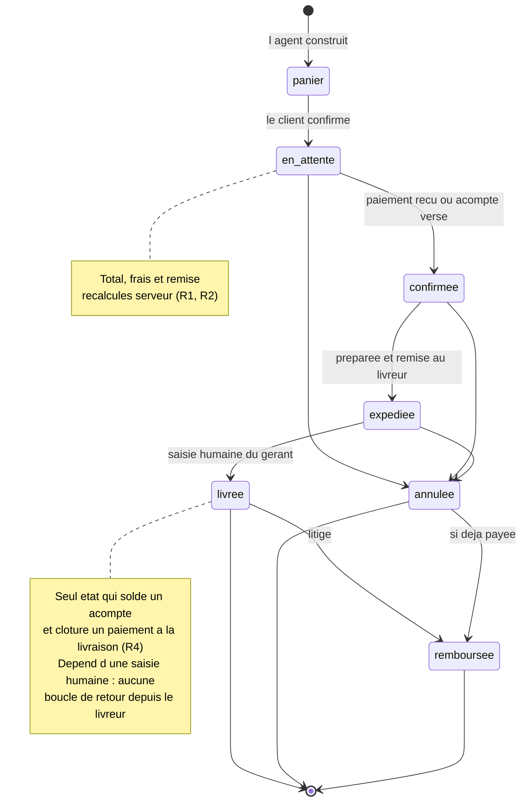

### 9.3 Cycle de vie d'une conversation — trois dimensions orthogonales

*Empêche : de confondre le statut métier, le régime de réponse et la fenêtre Meta — trois choses
distinctes qui gouvernent des comportements différents.*

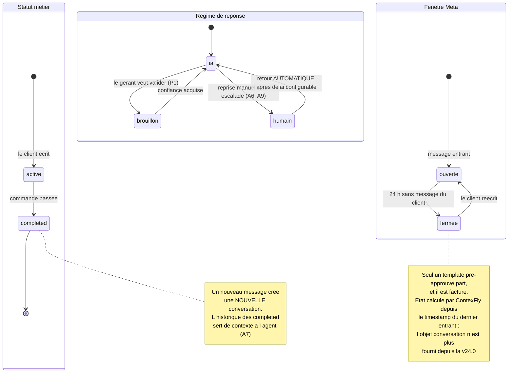

### 9.4 Cycle de vie d'un message sortant

*Empêche : de traiter un `200 OK` comme un envoi réussi, et d'exiger `delivered` avant `read`.*

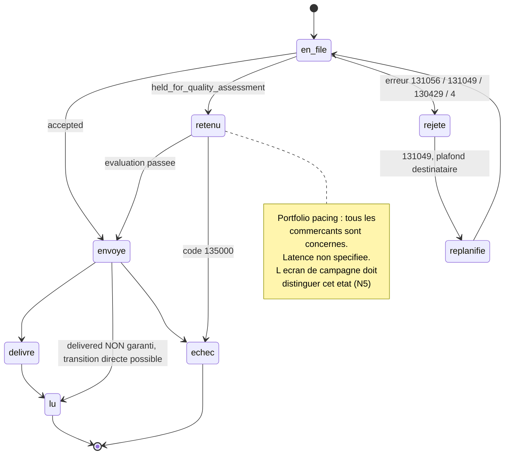

### 9.5 Cycle de vie d'un template WhatsApp

*Empêche : de modéliser 3 états là où Meta en renvoie 14, et d'oublier qu'un template peut être
mis en pause **entre** sa création et son envoi.*

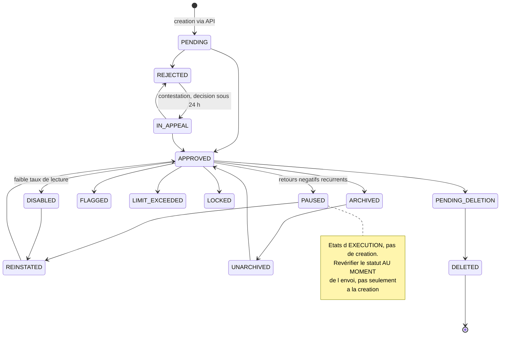

### 9.6 Dépendances entre modules et ordre de construction

*Empêche : de commencer par le mauvais bout, et de créer un cycle.*
⚠️ **Comble une lacune : les sections « Cartographie des dépendances » et « Ordre de construction »
de `Modules.md` étaient vides.**

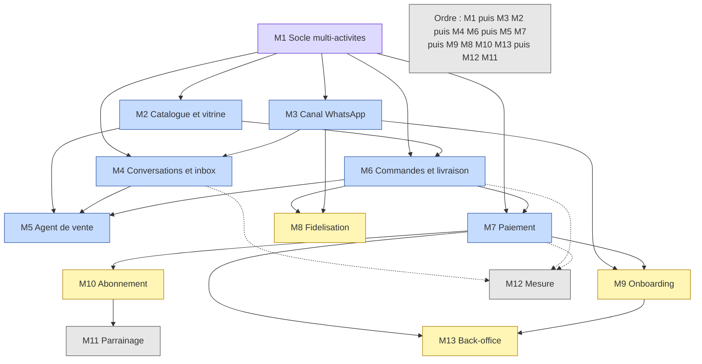

**Aucun cycle.** Ordre de construction retenu :
1. **M1** — socle multi-activités. Tout en dépend, et le rétrofit coûte plus cher que la
   fonctionnalité (G1).
2. **M3** et **M2** en parallèle — le canal et le catalogue ne dépendent que du socle.
3. **M4** et **M6** — conversations et commandes.
4. **M5** et **M7** — l'agent et le paiement, les deux plus coûteux. Ils arrivent en quatrième
   position **non par confort mais par nécessité** : l'agent a besoin du catalogue et des
   commandes pour avoir des outils à appeler.
5. **M9, M8, M10, M13** — onboarding, fidélisation, abonnement, back-office.
6. **M12** et **M11** — mesure et parrainage, en lecture seule sur le reste.

⚠️ **M9 (onboarding) arrive en cinquième position dans l'ordre technique, alors que c'est la seule
barrière durable du produit et que sa dépendance externe (App Review Meta) est la plus longue.**
→ **La démarche administrative Meta doit démarrer au jour 1**, pendant qu'on construit M1.
